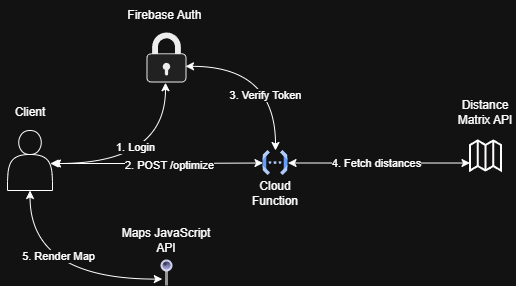
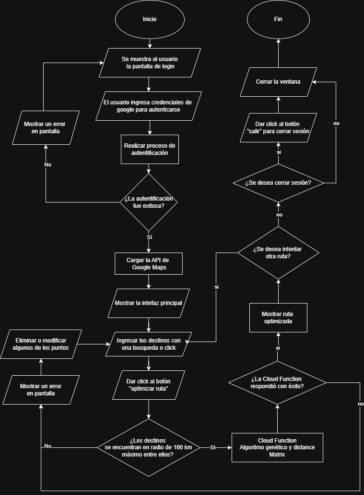

# Optimización de Rutas con Algoritmo Genético

Aplicación web full-stack que calcula y visualiza la ruta óptima entre múltiples destinos (hasta 15 puntos dentro de un radio de 100km) utilizando un algoritmo genético.

## Arquitectura del Sistema

El proyecto sigue una arquitectura Serverless orientada a eventos.

<p align="center">
  
</p>

1. **Cliente (React + Vite)**: Interfaz de usuario donde se ingresan los destinos y se visualiza la ruta en Google Maps.
2. **Firebase Auth**: Maneja el inicio de sesión. El cliente obtiene un token JWT válido.
3. **Cloud Function (Python)**: Recibe el payload con las ubicaciones y el JWT. Valida la identidad del usuario y procesa la lógica pesada.
4. **Google Maps APIs**: Se utiliza *Distance Matrix API* en el backend para obtener las distancias reales, y *Maps JavaScript API* en el frontend para el renderizado.
5. **Seguridad**: Se utilizan variables de entorno de GCP para proteger las API Keys, y restricciones de IP en el ingreso.

## Flujo del Usuario

El flujo completo del usuario abarca desde el inicio de sesión hasta la visualización final del mapa.

<p align="center">
  
</p>

## Estructura del Repositorio

- `/backend`: Funciones serverless en Python y lógica del algoritmo genético.
- `/frontend`: Aplicación SPA creada con React + Vite.
- `/diagrams`: Diagramas de arquitectura y flujo en formato source y exportado.

---

## Instrucciones de Instalación y Ejecución Local

### Prerrequisitos
- [Python 3.10+](https://www.python.org/downloads/)
- [uv](https://github.com/astral-sh/uv) instalado (Ejecuta: `python -m pip install uv` o `pip3 install uv`)
- [Node.js 18+](https://nodejs.org/)

### 1. Clonar el repositorio
```bash
git clone https://github.com/GerardoFdez7/route-optimizer.git
cd route-optimizer
```

### 2. Configuración del Backend
```bash
cd backend

# Crear entorno virtual con Python 3.11 (recomendado para Cloud Functions)
py -m uv venv --python 3.11

# Instalar dependencias apuntando al entorno virtual
py -m uv pip install -r requirements.txt --python .\.venv

# Activar el entorno virtual para tu editor de código:
- WINDOWS (PowerShell): .\.venv\Scripts\activate
- MAC/LINUX: source .venv/bin/activate

# Configurar variables de entorno
cp .env.example .env

# Ejecutar la Cloud Function de manera local
python -m functions_framework --target=optimize_route --debug
```
*Asegúrate de colocar tu API Key real en el archivo `.env`.*

### 3. Configuración del Frontend
```bash
cd frontend

# Instalar dependencias
npm install

# Configurar variables de entorno
cp .env.example .env.local

# Levantar servidor de desarrollo
npm run dev
```
